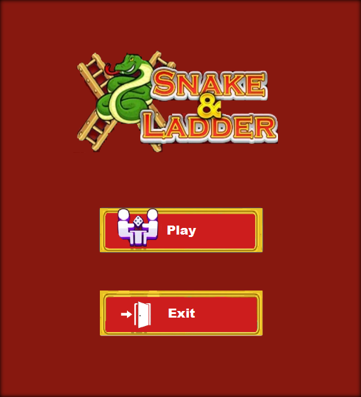
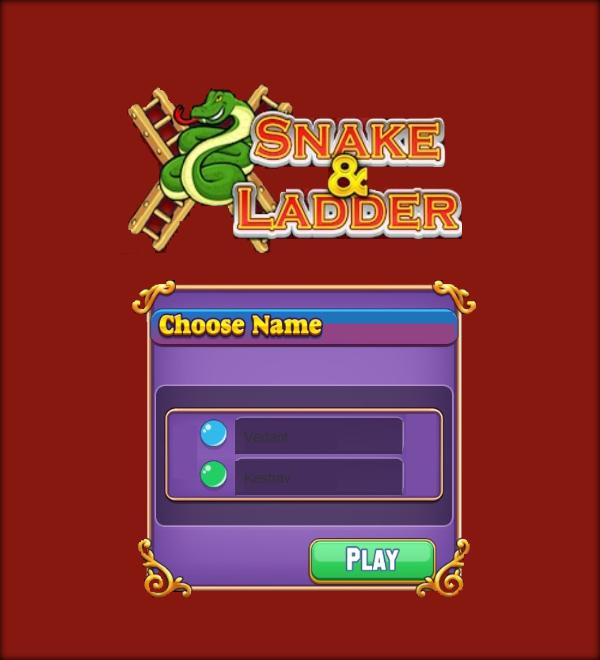
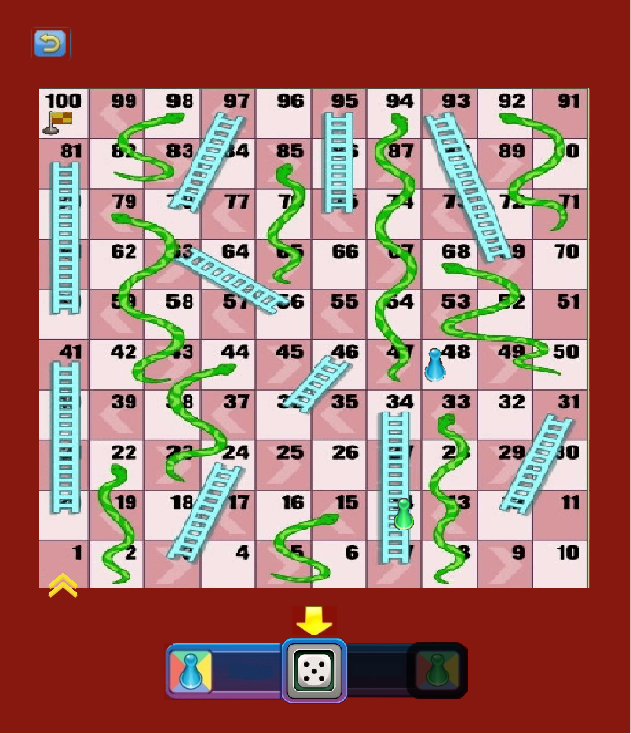
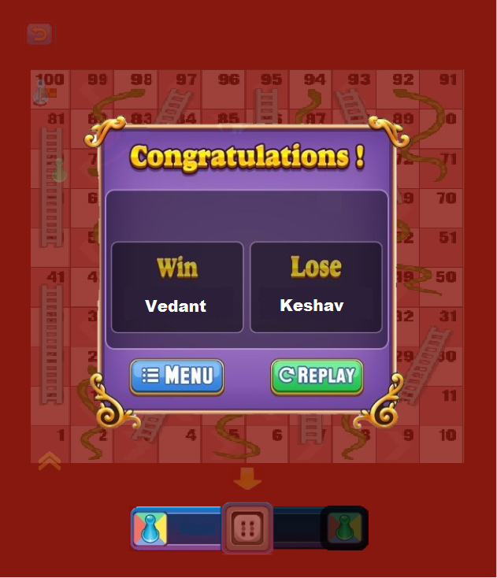

# Snakes and Ladders (JavaFX)

A two-player Snakes and Ladders desktop game written in Java with JavaFX and FXML. It began as a course project at IIIT-Delhi (Advanced Programming, 2021), where the brief was to clone the Snake & Ladder mode of the *Ludo Master* mobile app. The result has a splash screen, animated menus, a dice, player pieces that walk the board tile by tile, and a win screen.

<p align="center">
  
  &nbsp;
  
</p>
<p align="center">
  
  &nbsp;
  
</p>

## Features

- **Splash screen and main menu.** After a 2-second splash, the menu offers **Play** and **Exit**.
- **Player names.** A "Choose Name" dialog slides in for two players. Names may contain letters, digits and spaces. Empty or invalid names fall back to "Player 1" / "Player 2".
- **Classic 10 x 10 board** with 10 ladders and 10 snakes (see the table below).
- **Dice.** Clicking the dice rolls 1 to 6 and shows the matching face. An arrow bounces over it to prompt you, and each player's badge dims or lights up to show whose turn it is.
- **Rules as coded:**
  - Each player needs a **1** to enter the board.
  - Turns alternate after every roll, with no extra turn on a 6.
  - Pieces move one tile at a time along the snaking path (left to right, then right to left).
  - Landing on a ladder's foot climbs it; landing on a snake's head slides down it.
  - You need the **exact** roll to reach 100. A roll that would overshoot is skipped.
- **Win screen** showing the winner and loser, with **Menu** and **Replay** buttons.
- **In-game back button** that opens a pop-up to return to the board or go back to the main menu.

| Ladders (from → to) | Snakes (from → to) |
|---|---|
| 3 → 24, 7 → 34, 12 → 31, 20 → 41, 36 → 46 | 15 → 5, 22 → 2, 33 → 8, 44 → 23, 68 → 50 |
| 56 → 63, 60 → 81, 69 → 93, 75 → 95, 78 → 97 | 79 → 43, 85 → 65, 92 → 71, 94 → 47, 98 → 82 |

## How to play

1. Click **Play**, type the two players' names (optional) and click **PLAY** in the dialog.
2. Player 1 (blue) goes first. Click the dice in the bottom bar to roll. You need a 1 to put your piece on the board.
3. Take turns clicking the dice. Climb ladders, avoid snakes, and land on **100** exactly to win.
4. On the win screen, choose **Replay** for a new game or **Menu** to return to the main menu.

## Requirements

- **JDK 17 or newer.** It is tested with Temurin 21.
- **Maven 3.8+.**
- You don't need to install JavaFX separately. Maven downloads the right JavaFX 21 libraries for Windows, macOS (Intel or Apple Silicon) or Linux.

If you use [mise](https://mise.jdx.dev/), it can provide both tools without a global install:

```sh
mise exec java@21 maven@3 -- mvn javafx:run
```

## Build and run

Clone the repository:

```sh
git clone https://github.com/happyc0der/snakes-and-ladders-java.git
cd snakes-and-ladders-java
```

The commands are the same on **Windows** (PowerShell or Command Prompt) and **macOS / Linux** (Terminal):

```sh
mvn javafx:run          # compile and launch the game
mvn clean package       # compile and build target/snakes-and-ladders-1.0.0.jar
```

**Installing the tools:**

- **macOS:** `brew install openjdk@21 maven`
- **Windows:** install a JDK with `winget install EclipseAdoptium.Temurin.21.JDK`. Then get Maven from [maven.apache.org](https://maven.apache.org/download.cgi) (or `scoop install maven`), or use mise as shown above.

The jar doesn't bundle JavaFX, so launch the game with `mvn javafx:run` rather than `java -jar`.

## Project structure

```
.
├── pom.xml                 Maven build (JavaFX 21, Java 17, javafx-maven-plugin)
├── src/                    Original IntelliJ layout; Maven uses it as-is
│   ├── *.png               Artwork: board, dice faces, pieces, buttons, dialogs
│   └── sample/
│       ├── Main.java       Application entry point: stage, splash, board setup
│       ├── Controller.java Event handlers, scene switching, piece movement, animations
│       ├── Player.java     Player model (name, current tile, on-board / winner flags)
│       ├── Dice.java       Random 1-6 roll
│       ├── Objects.java    Marker interface for things placed on the board
│       ├── Ladders.java    Ladder (start tile → end tile)
│       ├── Snakes.java     Snake (head tile → tail tile)
│       ├── sample.fxml     Splash screen
│       ├── menu.fxml       Main menu and "Choose Name" dialog
│       └── Board.fxml      Game board, dice bar, win and back pop-ups
├── readme_images/          Screenshots used in this README
└── LICENSE.md              MIT
```

## Design notes

- **MVC with FXML.** The three screens (`sample.fxml`, `menu.fxml`, `Board.fxml`) are declarative FXML views, built with Scene Builder. A single `Controller` class handles their events. `Player`, `Dice`, `Snakes` and `Ladders` are plain model classes. Screens are swapped by loading a new FXML file into the one `Stage`.
- **Polymorphic board.** `Snakes` and `Ladders` both implement the marker interface `Objects`. The board is an `Objects[100]` array with a snake, a ladder or `null` in each cell. After a move, the controller checks the landing cell with `instanceof` and applies the jump.
- **Tile ↔ grid mapping.** At startup, `Main.map_init()` builds a `Map<Integer, Pair>` from tile number (1-100) to its (row, column) on the grid, following the zig-zag order of a real board. Piece movement and snake or ladder jumps are computed from this mapping and fixed per-tile pixel offsets.
- **Encapsulation.** Snake and ladder endpoints and a player's role are `final private` fields, exposed only through getters.
- **Animations.** `TranslateTransition` slides the dialogs (name entry, win screen, back menu) on and off screen and bounces the dice arrow. `FadeTransition` dims the board behind pop-ups and switches the active player's highlight.

## Credits

Originally built by Vedant (@oo7vedant-IIITD) and Keshav Rajput (@happyc0der) for IIIT-Delhi's Advanced Programming course (2021). Keshav worked on the UI and the two bug-tested the game together; the original repository is [oo7vedant-IIITD/SnakeScape](https://github.com/oo7vedant-IIITD/SnakeScape) (this is a fork). This fork adds a Maven build and README (2026).

The fork also fixes resource loading so the game runs from a fresh clone. The original loaded images from an absolute `D:\` path on the author's machine, and two file names differed only in letter case.

## License

MIT. See [LICENSE.md](LICENSE.md).
